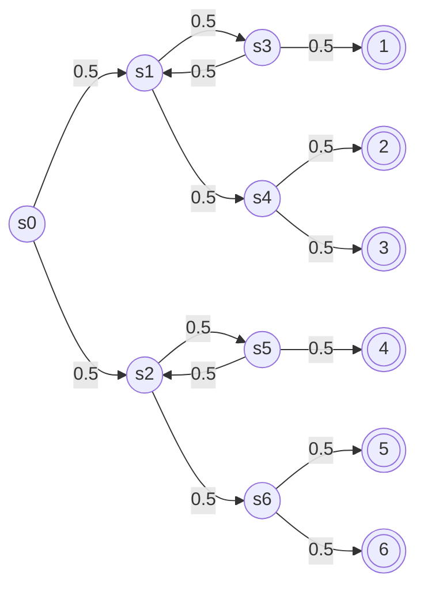

## Knuth's Die Algorithm

```mermaid
flowchart LR
    s0((s0)) --0.5--> s1((s1))
    s0 --0.5--> s2((s2))
    s1 --0.5--> s3((s3))
    s1 --0.5--> s4((s4))
    s3 --0.5--> s1
    s3 --0.5--> 1@{ shape: dbl-circ, label: "1" }
    s4 --0.5--> 2@{ shape: dbl-circ, label: "2" }
    s4 --0.5--> 3@{ shape: dbl-circ, label: "3" }
    s2 --0.5--> s5((s5))
    s2 --0.5--> s6((s6))
    s5 --0.5--> s2
    s5 --0.5--> 4@{ shape: dbl-circ, label: "4" }
    s6 --0.5--> 5@{ shape: dbl-circ, label: "5" }
    s6 --0.5--> 6@{ shape: dbl-circ, label: "6" }
```
